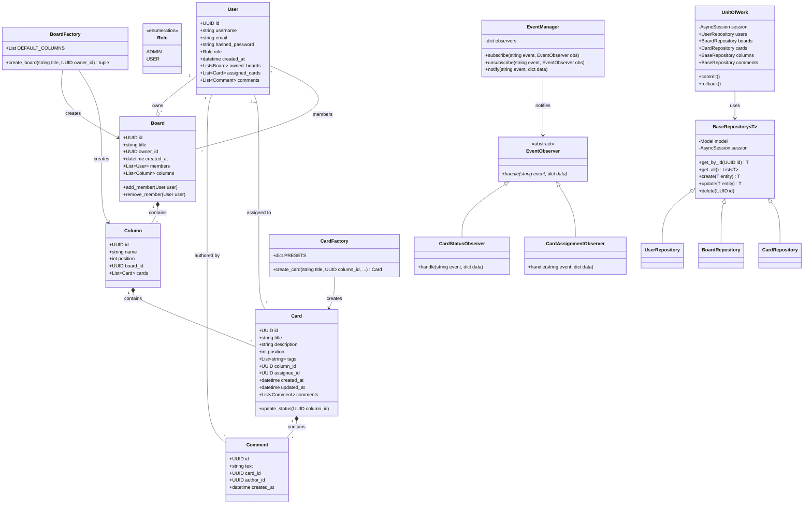

# Base Kanban Trello — Документація архітектури

## 1. Технологічний стек

| Компонент | Технологія                             |
| --------- | -------------------------------------- |
| Backend   | Python 3.11 (FastAPI)                  |
| Frontend  | React 18 (Vite) + Shadcn UI + Tailwind |
| Database  | PostgreSQL 16                          |
| ORM       | SQLAlchemy 2.0 (async)                 |
| Auth      | JWT (python-jose + passlib/bcrypt)     |
| DnD       | @hello-pangea/dnd                      |
| State     | Zustand                                |
| Infra     | Docker, Docker Compose                 |

## 2. Архітектура

### Багатошарова архітектура (Layered Architecture) + MVC

```
┌──────────────────────────────────────────────────┐
│                   Frontend (View)                │
│   React + Shadcn UI + @hello-pangea/dnd          │
│   Pages: Login, Register, Boards, Board, Admin   │
└────────────────────┬─────────────────────────────┘
                     │ HTTP / REST API
┌────────────────────▼─────────────────────────────┐
│               Routers (Controllers)              │
│   auth.py, users.py, boards.py, cards.py         │
├──────────────────────────────────────────────────┤
│               Services (Business Logic)          │
│   AuthService, UserService, BoardService,        │
│   CardService                                    │
├──────────────────────────────────────────────────┤
│            Patterns (GoF)                        │
│   Observer (EventManager), Factory (Card/Board)  │
├──────────────────────────────────────────────────┤
│         Repositories + Unit of Work              │
│   BaseRepository<T>, UserRepo, BoardRepo,        │
│   CardRepo, UnitOfWork                           │
├──────────────────────────────────────────────────┤
│               Models (ORM)                       │
│   User, Board, Column, Card, Comment             │
├──────────────────────────────────────────────────┤
│            Database (PostgreSQL)                 │
└──────────────────────────────────────────────────┘
```

## 3. Патерни проектування (GoF)

### 3.1 Repository (Сховище)

**Файли:** `repositories/base.py`, `repositories/user_repository.py`, `repositories/board_repository.py`, `repositories/card_repository.py`

**Обґрунтування:**

- Ізолює логіку доступу до даних від бізнес-логіки (SRP).
- Полегшує тестування — можна підставити mock-репозиторій.
- Єдина точка для CRUD-операцій кожної сутності.
- `BaseRepository<T>` — Generic-клас, що забезпечує повторне використання коду (DRY).

### 3.2 Unit of Work (Одиниця роботи)

**Файл:** `repositories/unit_of_work.py`

**Обґрунтування:**

- Координує роботу кількох репозиторіїв у межах однієї транзакції.
- Гарантує атомарність операцій (все або нічого).
- Єдина точка управління commit/rollback.

### 3.3 Observer (Спостерігач)

**Файл:** `patterns/observer.py`

**Обґрунтування:**

- Забезпечує слабку зв'язність між компонентами.
- При зміні статусу картки або призначенні виконавця автоматично сповіщуються підписники.
- Нові обробники подій додаються без модифікації існуючого коду (OCP).
- Реалізовано: `CardStatusObserver`, `CardAssignmentObserver`.

### 3.4 Factory (Фабрика)

**Файл:** `patterns/factory.py`

**Обґрунтування:**

- Інкапсулює логіку створення об'єктів.
- `CardFactory` — створює картки з різними пресетами (urgent, bug, feature).
- `BoardFactory` — створює дошку зі стандартним набором колонок (To Do, In Progress, Done).
- Клієнтський код не знає деталей конструювання.

## 4. Принципи SOLID

| Принцип                       | Де реалізовано                                                   |
| ----------------------------- | ---------------------------------------------------------------- |
| **S** — Single Responsibility | Кожен сервіс/репозиторій відповідає за одну сутність             |
| **O** — Open/Closed           | Observer — нові обробники без зміни коду; Factory — нові пресети |
| **L** — Liskov Substitution   | BaseRepository<T> — нащадки замінюють базовий клас               |
| **I** — Interface Segregation | Окремі Pydantic-схеми: Create, Update, Response                  |
| **D** — Dependency Inversion  | FastAPI DI; UoW абстрагує доступ до даних                        |

## 5. UML-діаграма класів (Mermaid)



## 6. Структура API (REST)

| Метод  | Маршрут                          | Опис                          |
| ------ | -------------------------------- | ----------------------------- |
| POST   | `/api/auth/register`             | Реєстрація                    |
| POST   | `/api/auth/login`                | Авторизація                   |
| GET    | `/api/users/me`                  | Профіль поточного користувача |
| PUT    | `/api/users/me`                  | Оновити профіль               |
| GET    | `/api/users/`                    | Список усіх користувачів      |
| PUT    | `/api/users/{id}`                | [Admin] Оновити користувача   |
| DELETE | `/api/users/{id}`                | [Admin] Видалити користувача  |
| POST   | `/api/boards/`                   | Створити дошку                |
| GET    | `/api/boards/`                   | Мої дошки                     |
| GET    | `/api/boards/{id}`               | Деталі дошки                  |
| PUT    | `/api/boards/{id}`               | Оновити дошку                 |
| DELETE | `/api/boards/{id}`               | Видалити дошку                |
| POST   | `/api/boards/{id}/members/{uid}` | Додати учасника               |
| DELETE | `/api/boards/{id}/members/{uid}` | Видалити учасника             |
| POST   | `/api/boards/{id}/columns`       | Створити колонку              |
| PUT    | `/api/boards/columns/{id}`       | Оновити колонку               |
| DELETE | `/api/boards/columns/{id}`       | Видалити колонку              |
| POST   | `/api/cards/column/{col_id}`     | Створити картку               |
| GET    | `/api/cards/column/{col_id}`     | Картки колонки                |
| GET    | `/api/cards/{id}`                | Деталі картки                 |
| PUT    | `/api/cards/{id}`                | Оновити картку                |
| PATCH  | `/api/cards/{id}/move`           | Drag-and-Drop переміщення     |
| DELETE | `/api/cards/{id}`                | Видалити картку               |
| POST   | `/api/cards/{id}/comments`       | Додати коментар               |
| GET    | `/api/cards/{id}/comments`       | Коментарі картки              |

## 7. Права доступу (RBAC)

| Роль                  | Можливості                                              |
| --------------------- | ------------------------------------------------------- |
| **Owner** (дошки)     | Повний доступ до дошки, керування учасниками, колонками |
| **Member**            | Створення/редагування карток, додавання коментарів      |
| **Admin** (системний) | Перегляд та редагування будь-яких користувачів          |

## 8. Запуск

```bash
# Запуск за допомогою Docker Compose
docker-compose up --build

# Frontend: http://localhost:3000
# Backend API: http://localhost:8000/docs
# PostgreSQL: localhost:5432
```

### Для локальної розробки (без Docker):

```bash
# Backend
cd backend
pip install -r requirements.txt
uvicorn app.main:app --reload

# Frontend
cd frontend
npm install
npm run dev
```
