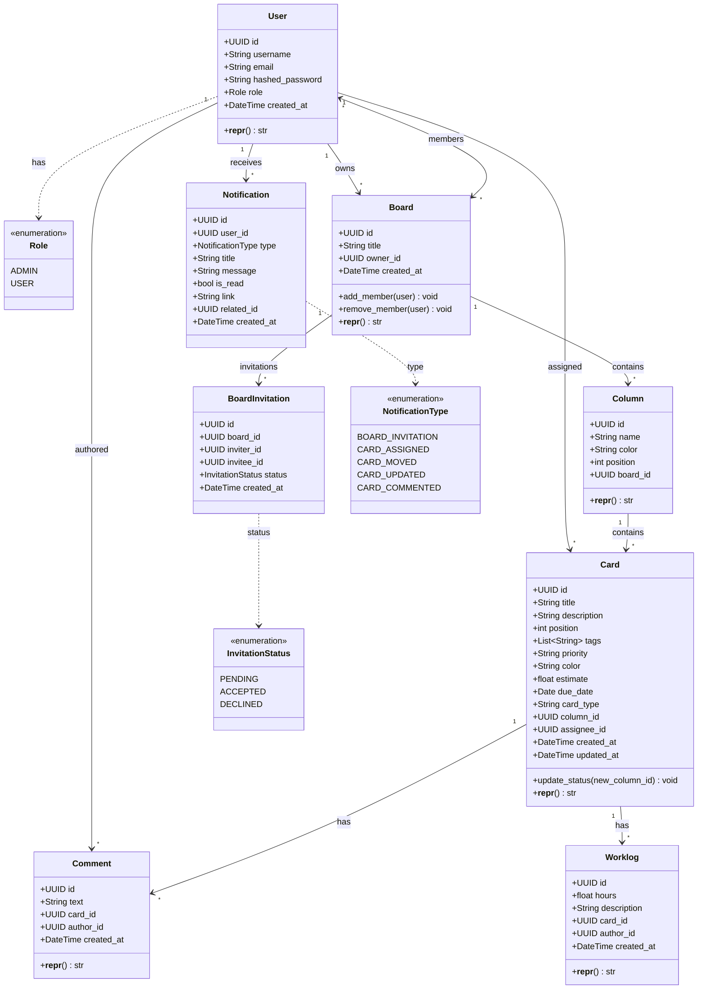
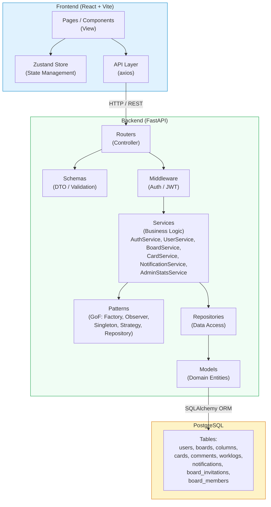
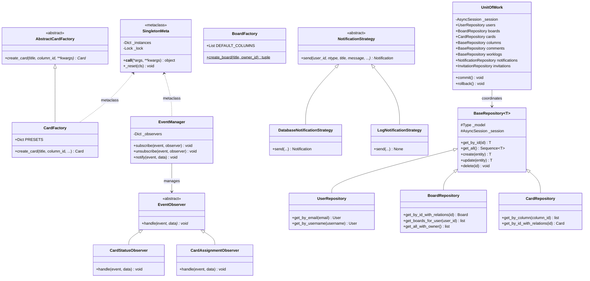
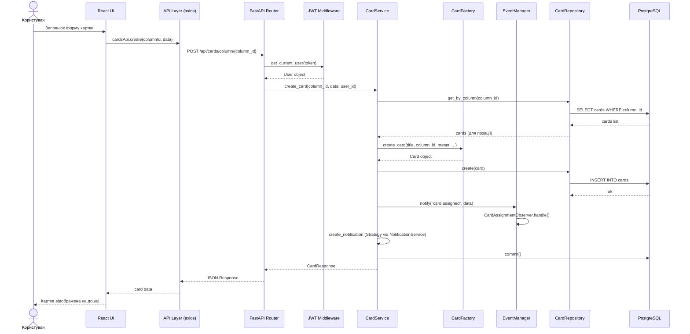
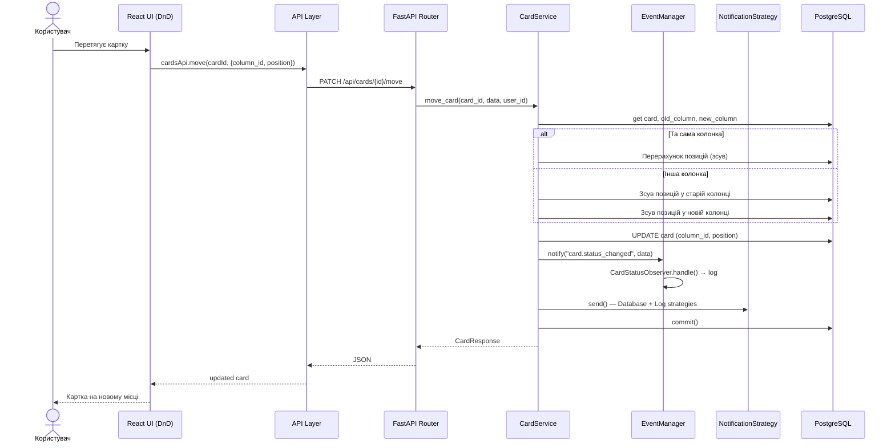
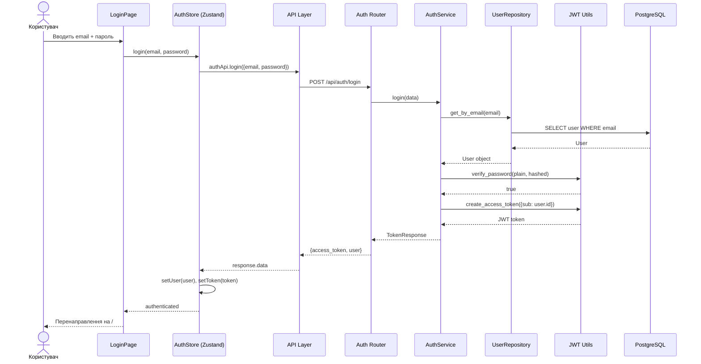
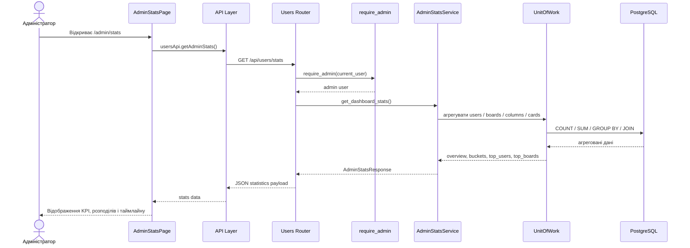
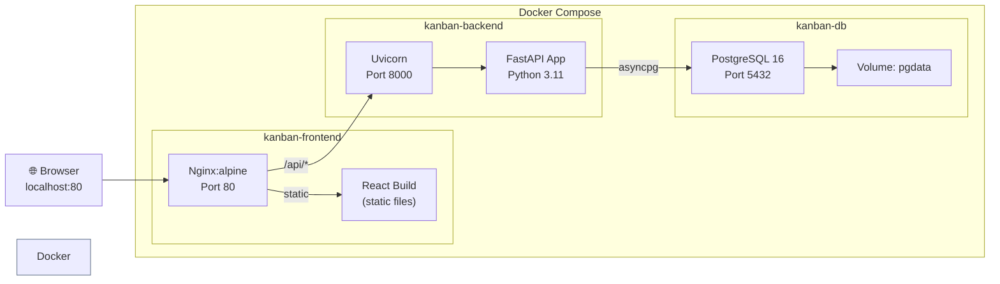

# UML Діаграми проєкту Base Kanban Trello

## 1. Діаграма класів (Class Diagram) — Domain Models

---

## 2. Діаграма компонентів (Component Diagram) — Архітектура

---

## 3. Діаграма патернів проєктування (GoF Patterns)

---

## 4. Діаграма послідовності (Sequence Diagram) — Створення картки

---

## 5. Діаграма послідовності — Drag-and-Drop переміщення картки

---

## 6. Діаграма послідовності — Автентифікація (Login)

---

## 7. Діаграма послідовності — Отримання адмін-статистики

---

## 7. Діаграма розгортання (Deployment Diagram)

